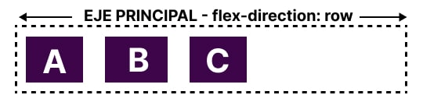
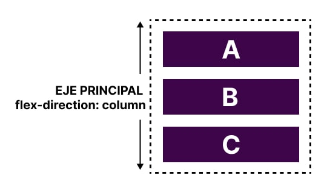
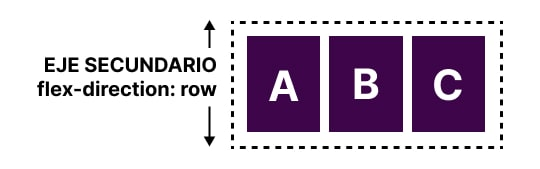
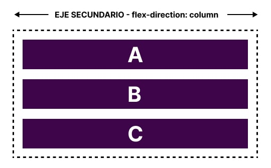

<Head>
  <title>{`Flexbox: introducción al diseño flexible - DivZone`}</title>
  <meta
    name="description"
    content="El diseño flexible, también conocido como Flexbox, es una de las herramientas más poderosas y versátiles en CSS, para la creación de diseños web modernos y responsivos."
  />
  <meta property="og:title" content=".." />
  <meta
    name="keywords"
    content="flexbox, diseño flexible, diseño web, responsivo"
  />
  <meta name="robots" content="index,follow" />
</Head>

# Flexbox: introducción al diseño flexible.

El diseño flexible, también conocido como Flexbox, es una de las **herramientas más poderosas y versátiles en CSS** para la creación de un diseño web moderno y responsivo. Flexbox facilita la alineación y distribución de elementos dentro de un contenedor, permitiendo un control más dinámico y adaptable de los elementos en una página web. En este artículo, exploraremos los conceptos básicos de Flexbox, cómo implementarlo y algunos ejemplos prácticos.

## Conceptos Básicos de Flexbox: Dos ejes

Cuando trabajas con flexbox necesitas pensar en términos de dos ejes: el eje principal y el eje transversal. El eje principal está definido por la propiedad de dirección flexible y el eje transversal corre perpendicular a él. Todo lo que hacemos con flexbox hace referencia a estos ejes, por lo que vale la pena entender cómo funcionan desde el principio.

## El eje principal

El eje principal está definido por flex-direction, que tiene cuatro valores posibles:

- **row** (fila)
- **row-reverse** (fila inversa)
- **column** (columna)
- **column-reverse** (columna-inversa)

Si elige fila o fila inversa, su eje principal se ejecutará a lo largo de la fila en la dirección en línea.



Elija columna o columna inversa y su eje principal se ejecutará en la dirección del bloque, desde la parte superior de la página hasta la parte inferior.



## El eje transversal

El eje transversal corre perpendicular al eje principal. Por lo tanto, si su dirección flexible (eje principal) está configurada en fila o fila inversa, el eje transversal recorre las columnas.



Si su eje principal es columna o columna inversa, entonces el eje transversal corre a lo largo de las filas.



## Líneas de inicio y fin

Otra área vital de comprensión es cómo flexbox no hace suposiciones sobre el modo de escritura del documento. Flexbox no solo asume que todas las líneas de texto comienzan en la parte superior izquierda de un documento y corren hacia el lado derecho, con nuevas líneas que aparecen una debajo de la otra. Más bien, admite todos los modos de escritura, al igual que otras propiedades y valores lógicos.

Si la `flex-direction` es `row` y estoy trabajando en inglés, entonces el borde inicial del eje principal estará a la izquierda y el borde final a la derecha.

Si tuviera que trabajar en árabe, entonces el borde inicial de mi eje principal estaría a la derecha y el borde final a la izquierda.

En ambos casos, el borde inicial del eje transversal está en la parte superior del contenedor flexible y el borde final en la parte inferior, ya que ambos idiomas tienen un modo de escritura horizontal.

Después de un tiempo, pensar en el inicio y el final en lugar de izquierda y derecha se vuelve natural y le resultará útil cuando trabaje con otros métodos de diseño, como CSS Grid Layout, que siguen los mismos patrones.

## Flex Container

El contenedor flexible es el elemento padre que contiene los elementos flexibles. Para convertir un contenedor en un contenedor flexible, se debe aplicar la propiedad `display: flex` o `display: inline-flex`.

```css title="CSS"
.container {
  display: flex;
}
```

## Cambiando la dirección flexible

Agregar la propiedad `flex-direction` al contenedor flexible nos permite cambiar la dirección en la que se muestran nuestros elementos flexibles. Configurar `flex-direction: row-reverse `mantendrá los elementos mostrados a lo largo de la fila, sin embargo, se cambian las líneas inicial y final.

```css title="CSS"
.container {
  display: flex;
  /* row / row-reverse / column / column-reverse */
  flex-direction: row-reverse;
}
```

Si cambiamos `flex-direction` a `column`, el eje principal cambia y nuestros elementos ahora se muestran en una columna. Configure la columna inversa y las líneas inicial y final se cambiarán nuevamente.

```css title="CSS"
.container {
  display: flex;
  /* row / row-reverse / column / column-reverse */
  flex-direction: column;
}
```

## Contenedores flexibles multilínea con flex-wrap

Si bien flexbox es un modelo unidimensional, es posible hacer que los elementos flexibles se ajusten a varias líneas. Si hace esto, debe considerar cada línea como un nuevo contenedor flexible. Cualquier distribución del espacio se producirá en cada línea, sin referencia a las líneas anteriores o posteriores.

Para provocar un comportamiento de ajuste (wrapping), agregue la propiedad `flex-wrap` con un valor de `wrap`. Ahora, si sus elementos son demasiado grandes para mostrarlos todos en una línea, se ajustarán a otra línea.

```css title="CSS"
.container {
  display: flex;
  /* nowrap / wrap / wrap-reverse */
  flex-wrap: wrap;
}
```

## La taquigrafía de flujo flexible: flex-flow

Puede combinar las dos propiedades `flex-direction` y `flex-wrap` en la abreviatura `flex-flow`.

```css title="CSS"
.box {
  display: flex;
  flex-flow: row wrap;
}
```

## Propiedades aplicadas a elementos flexibles

Para controlar el tamaño en línea de cada elemento flexible, los apuntamos directamente a través de tres propiedades:

- flex-grow (crecimiento flexible)
- flex-shrink (flex-contraíble)
- flex-basis (base flexible)

Antes de que podamos darle sentido a estas propiedades, debemos considerar el concepto de espacio disponible. Lo que hacemos cuando cambiamos el valor de estas propiedades flexibles es cambiar la forma en que se distribuye el espacio disponible entre nuestros elementos. Este concepto de espacio disponible también es importante cuando analizamos la alineación de elementos.

## La propiedad de base flexible: flex-basis

La base flexible es la que define el tamaño de ese elemento en términos del espacio que deja como espacio disponible. El valor inicial de esta propiedad es automático; en este caso, el navegador busca si el elemento tiene un tamaño. En el ejemplo anterior, todos los elementos tienen un ancho de 100 píxeles. Esto se utiliza como base flexible.

Si los elementos no tienen un tamaño, entonces el tamaño del contenido se utiliza como base flexible. Es por eso que cuando simplemente declaramos display: flex en el padre para crear elementos flexibles, todos los elementos se mueven a una fila y ocupan solo el espacio que necesitan para mostrar su contenido.

```css title="CSS"
.box {
  flex-basis: 200px;
}
```

## La propiedad de crecimiento flexible: flex-grow

Con la propiedad flex-grow establecida en un entero positivo, si hay espacio disponible, el elemento flexible puede crecer a lo largo del eje principal desde su base flexible. Si el elemento se estira para ocupar todo el espacio disponible en ese eje, o solo una parte del espacio disponible, depende de si a los otros elementos también se les permite crecer y del valor de sus propiedades de crecimiento flexible.

Cada elemento con un valor positivo consume una parte del espacio disponible en función de su valor de crecimiento flexible. Si le dimos a todos nuestros elementos en el ejemplo anterior un valor de crecimiento flexible de 1, entonces el espacio disponible en el contenedor flexible se compartiría equitativamente entre nuestros elementos y se estirarían para llenar el contenedor en el eje principal. Si le damos a nuestro primer elemento un valor de crecimiento flexible de 2 y a los demás elementos un valor de 1 cada uno, hay un total de 4 partes; Se asignarán 2 partes del espacio disponible al primer elemento (100 px de 200 px en el caso del ejemplo anterior) y 1 parte a cada uno de los otros dos (50 px cada uno de los 200 px en total).

```css title="CSS"
.box {
  flex-grow: 0;
}
```

## La propiedad de contracción flexible: flex-shrink

Mientras que la propiedad flex-grow se ocupa de agregar espacio en el eje principal, la propiedad flex-shrink controla cómo se quita. Si no tenemos suficiente espacio en el contenedor para colocar nuestros elementos y flex-shrink se establece en un número entero positivo, entonces el elemento puede volverse más pequeño que la base flexible. Al igual que con flex-grow, se pueden asignar diferentes valores para hacer que un elemento se reduzca más rápido que otros: un elemento con un valor más alto establecido para flex-shrink se reducirá más rápido que sus hermanos que tienen valores más bajos.

Un elemento puede reducirse hasta su tamaño de contenido mínimo. Este tamaño mínimo se tiene en cuenta al calcular la cantidad real de contracción que se producirá, lo que significa que la contracción flexible tiene el potencial de parecer menos consistente en su comportamiento que el crecimiento flexible. Por lo tanto, veremos más detalladamente cómo funciona este algoritmo en el artículo Control de proporciones de elementos a lo largo del eje principal.

```css title="CSS"
.box {
  flex-shrink: 1;
}
```

## Valores abreviados para las propiedades flexibles.

Muy raramente verá las propiedades flex-grow, flex-shrink y flex-basis utilizadas individualmente; en cambio, se combinan en la taquigrafía flexible. La abreviatura flex le permite establecer los tres valores en este orden: flex-grow, flex-shrink, flex-basis.

:::tip NOTA
Estos valores para flex-grow y flex-shrink son proporciones. Normalmente, si tuviéramos todos nuestros elementos configurados en flex: 1 1 200px y luego quisiéramos que un elemento creciera al doble de velocidad, configuraríamos ese elemento en flex: 2 1 200px. Sin embargo, también puedes usar flex: 10 1 200px y flex: 20 1 200px si quieres.
:::

```css title="CSS"
.box {
  flex-grow: 0;
  flex-shrink: 1;
  flex-basis: auto;
}

/* Similar a: */

.box {
  flex: 0 1 auto;
}
```
