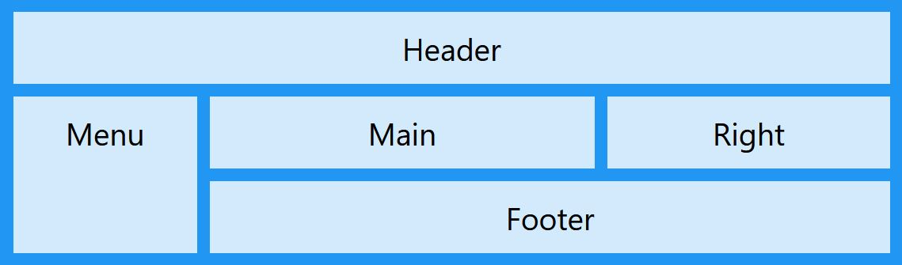
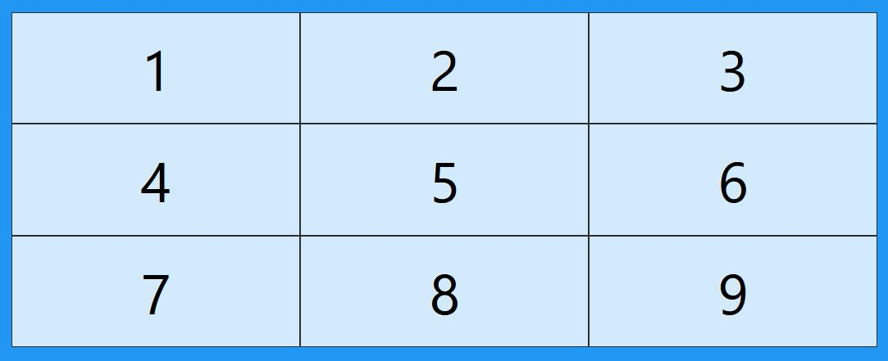
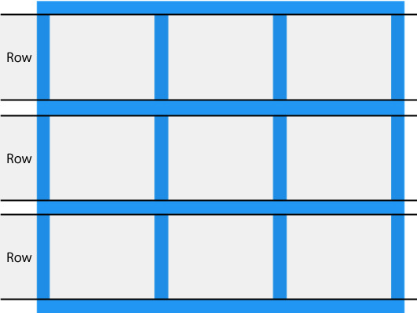
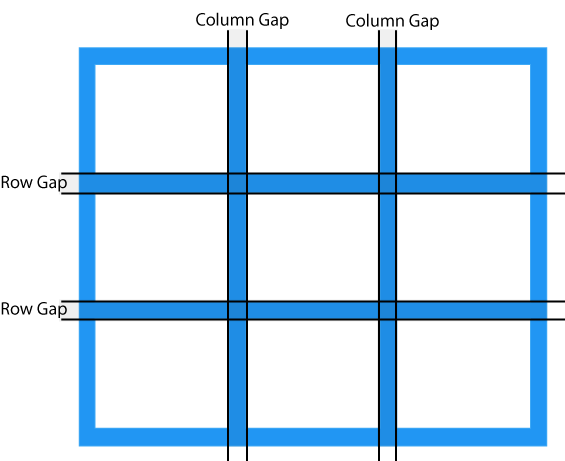

# Grid: creación de diseños en cuadrícula.



## Grid Layout

El módulo CSS Grid Layout ofrece un sistema de maquetación basado en rejilla, con filas y columnas, que facilita el diseño de páginas web sin tener que utilizar flotadores ni posicionadores. Todos los hijos directos del contenedor de rejilla se convierten automáticamente en elementos de rejilla.

```css title="CSS"
.container {
  display: grid | inline-grid;
}
```



## Columnas de cuadrícula

Las líneas verticales de los elementos de la rejilla se denominan columnas (column).


## Filas de cuadrícula

Las líneas horizontales de los elementos de la cuadrícula se denominan filas (row).



## Espacios de la cuadrícula (gap)

Los espacios entre cada columna/fila se denominan huecos (gap).



Puede ajustar el tamaño de los espacios utilizando una de las siguientes propiedades:

- column-gap
- row-gap
- gap

## Ejemplos

La propiedad column-gap establece el espacio entre las columnas:

```css title="CSS"
.grid-container {
  mostrar: rejilla;
  espacio-columna: 50px;
}
```

La propiedad row-gap establece el espacio entre las filas:

```css title="CSS"
.grid-container {
  display: grid;
  row-gap: 50px;
}
```

La propiedad gap es una propiedad abreviada para las propiedades row-gap y column-gap:

```css title="CSS"
.grid-container {
  display: grid;
  gap: 50px 100px;
}
```

La propiedad gap también se puede utilizar para establecer tanto la separación entre filas como la separación entre columnas en un solo valor:

```css title="CSS"
.grid-container {
  display: grid;
  gap: 50px;
}
```
