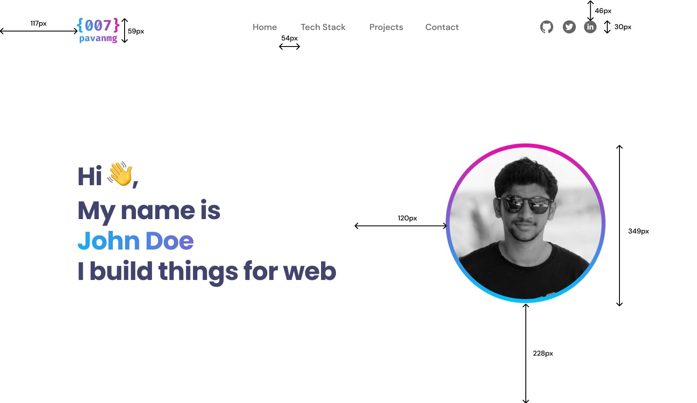
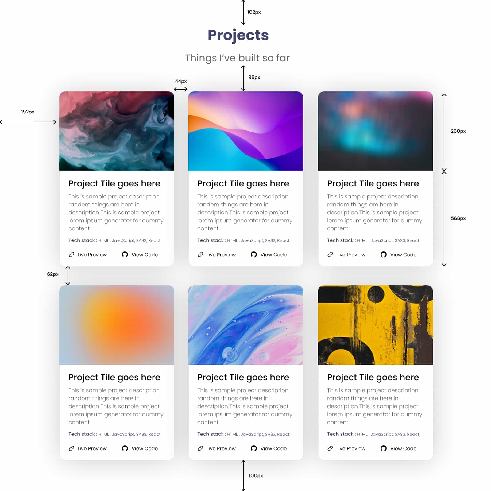
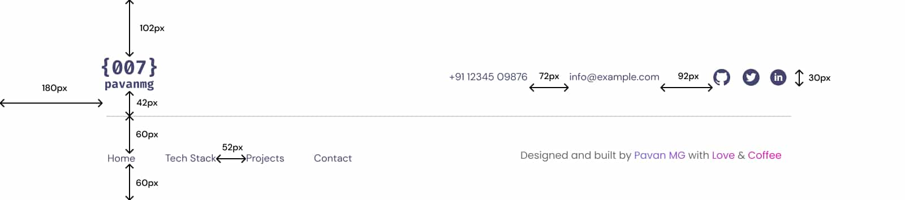

import YouTubeEmbed from "@site/src/components/YouTubeEmbed/YouTubeEmbed";

# Ejercicio 9 - Videos ▶

## Creación de un Portafolio Completo con HTML y CSS En Videos

En este ejercicio, vamos a desarrollar un portafolio web completo utilizando HTML y CSS. Para el diseño, seguiremos el proyecto de **Pavan MG** en **Figma**.

Este proyecto incluye cuatro secciones distintas en una única página, con enlaces "ancla" en un menú principal para facilitar la navegación.

## Estructura del Proyecto

El portafolio constará de las siguientes secciones:

1. **Main:** La sección principal, que incluirá un header, una breve introducción y una imagen destacada.
2. **Stack:** Aquí se detallará la tecnología y las herramientas que utilizas, con iconos y descripciones breves.
3. **Projects:** Una galería de tus proyectos más importantes, cada uno con una imagen, un título y una breve descripción.
4. **Footer:** El pie de página, que incluirá enlaces a tus redes sociales y tu información de contacto.

## Imagen principal del portfolio


## Fuentes

Vamos a utilizar dos tipos de fuentes. Para instalarlas, en nuestro archivo css vamos a escribir lo siguiente:

```css title="style.css"
@import url("https://fonts.googleapis.com/css2?family=DM+Sans:ital,opsz,wght@0,9..40,100..1000;1,9..40,100..1000&display=swap");
@import url("https://fonts.googleapis.com/css2?family=DM+Sans:ital,opsz,wght@0,9..40,100..1000;1,9..40,100..1000&family=Poppins:ital,wght@0,100;0,200;0,300;0,400;0,500;0,600;0,700;0,800;0,900;1,100;1,200;1,300;1,400;1,500;1,600;1,700;1,800;1,900&display=swap");
```

En el siguiente ejemplo podemos ver como utilizar las fuentes importadas de Google-Fonts.

```css title="style.css"
p {
  font-family: "Poppins", sans-serif;
}
h1 {
  font-family: "DM Sans", sans-serif;
}
```

## Estilos generales

Luego de importar las fuentes. Te recomiendo aplicar los siguientes estilos generales en tu hoja de estilos css.

```css title="style.css"
html,
body {
  margin: 0;
  height: 100%;
  word-wrap: break-word;
  box-sizing: border-box;
  font-family: "Poppins", sans-serif;
  font-size: 16px;
}
```

## Detalles del Diseño

Las imágenes de cada sección, cuentan con las medidas más importantes. Además en las diferentes secciones, se indican colores, estilos y tamaños de fuentes.

## 1. Portfolio - Sección Main

<YouTubeEmbed
  videoId="vQ-y_1Z4HeM?si=J2ysWyfSJeCmaL5f"
  videoTitle="#1 Cómo Crear Un Portafolio Con HML y CSS Para Principiantes
"
/>



### Detalles de diseño de la sección Main:

- **Logo:** Puede ser una imagen svg o png de no más de 60px de alto, con tu nombre. También puedes usar un texto "span".
- **Links:** Fuente "DM Sans", Medium, de 20px y color `#666`.
- **Iconos:** De tamaño 30px x 30px, y `fill` de `#666`.
- **Texto principal:** Fuente "Poppins", Bold, de 58px, color `#42446E` y espacio entre líneas de -1px. Además, un fragmento del texto tiene un color degradado que va de 0% - `#13B0F5` a 100% - `#E70FAA`
- **Imagen principal:** Circular de 350px con borde de color degradado que va de 0% - `#E70FAA` a 100% - `#00C0FD`.

## 2. Portfolio - Sección Stack

<YouTubeEmbed
  videoId="zQ6lyanxGjo?si=28aYZYB1WdRpoxpe"
  videoTitle="#2 Cómo Crear Un Portafolio Con HML y CSS Sección Stack"
/>


### Detalles de diseño de la sección Stack:

- **Título:** Fuente "Poppins", Bold, de 48px y color `#42446E`.
- **Subtítulo:** Fuente "Poppins", Regular, de 32px y color `#666`.
- **Iconos:** Contenedor `div` de 120px x 120px con un padding de 8px.

## 3. Portfolio - Sección Projects

<YouTubeEmbed
  videoId="Ek4YemsEpQg?si=GXK_DhU3vnUAn8OE"
  videoTitle="#3 Cómo Crear Un Portafolio Con HML y CSS Sección Projects"
/>



### Detalles de diseño de la sección Projects:

- **Títulos de cards:** Fuente "Poppins", Bold, de 48px y color `#42446E`.
- **Párrafos de cards:** Fuente "Poppins", Light, de 18px, color `#666` y espacio entre líneas de 0.
- **Tech stack de cards:** Fuente "Poppins", Regular, de 16px y color `#42446E`. Con fragmento de estilo Light.
- **Enlaces en footer de cards:** Fuente "Poppins", Regular, de 16px, color `#000`. Tamaño de iconos 20px x 20px.

## 4. Portfolio - Sección Footer

<YouTubeEmbed
  videoId="B0i2b8wF_yw?si=8e2Yi2jzIi6RmU7T"
  videoTitle="#4 Cómo Crear Un Portafolio Con HML y CSS Sección Footer"
/>



### Detalles de diseño de la sección Footer:

- **Enlaces:** Fuente "Poppins", Regular, de 18px y color `#42446E`.

### 5. Portfolio - Implementando Display Grid

<YouTubeEmbed
  videoId="myE7TQSbrxQ?si=YNhpw9mxNGGbTrmw"
  videoTitle="#5 Cómo Crear Un Portafolio Con HML y CSS - Implementando Display Grid"
/>

### 6. Portfolio - Responsive y Media Queries

<YouTubeEmbed
  videoId="itbEpkudfyE?si=fk3bsMVFtj2-p8Mn"
  videoTitle="#6 Cómo Crear Un Portafolio Con HML y CSS - Responsive y Media Queries"
/>

### 7. Portfolio - Responsive, Enlaces ancla y Sidebar mobile desplegable

<YouTubeEmbed
  videoId="ZBBkyEqnC7Y?si=Y-M7WLLz1sePWDWz"
  videoTitle="#7 Cómo Crear Un Portafolio Con HML y CSS - Responsive, Enlaces ancla y Sidebar mobile desplegable"
/>

### 8. Portfolio - JavaScript classList, variables css, logo y min-height 100vh

<YouTubeEmbed
  videoId="pN1F2mw0WhI?si=2nnlVSPRb0sxnUqc"
  videoTitle="#8 Cómo Crear Un Portafolio - JavaScript classList, variables css, logo y min-height 100vh"
/>

### Recursos

1. [**Imágenes del proyecto**](https://drive.google.com/drive/folders/1DqbHwb3xi8jrhQ1skP8VQ7VK6P54Gdg0?usp=sharing "Imágenes del proyecto link")

2. [**Fuente Poppins**](https://fonts.google.com/specimen/Poppins "Fuente Poppins link")

3. [**Fuente DM Sans**](https://fonts.google.com/specimen/DM+Sans "Fuente DM Sans link")

4. [**Iconos de React Icons**](https://react-icons.github.io/react-icons/ "Iconos de React Icons link")
