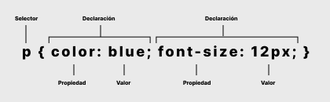

import CodePenLite from "@site/src/components/code-pen-lite/CodePenLite";
import Link from "@docusaurus/Link";

<Head>
  <title>{`Estructura y Estilización de Páginas Web con CSS`}</title>
  <meta
    name="description"
    content="CSS (Cascading Style Sheets) es un lenguaje utilizado para estilizar la estructura HTML de un documento por medio de hojas de estilo."
  />
  <meta
    property="og:title"
    content="Estructura y Estilización de Páginas Web con CSS"
  />
  <meta
    name="keywords"
    content="Estructura HTML, Estilización CSS, hojas de estilo, tutorial, desarrollo web"
  />
  <meta name="robots" content="index,follow" />
</Head>

# Estructura y Estilización de Páginas Web con CSS

**CSS (Cascading Style Sheets)** es un lenguaje utilizado para **estilizar** la **estructura HTML** de un documento por medio de **hojas de estilo**. Mientras que **HTML** proporciona la estructura y el contenido de la página, **CSS** se encarga de la apariencia visual, permitiendo a los desarrolladores web crear sitios atractivos y con una buena experiencia de usuario.
En este artículo, exploraremos los **conceptos básicos de CSS**, sus ventajas y algunas técnicas fundamentales para estilizar páginas web.

:::tip
Para comprender mejor esta sección, te recomendamos ver primero los artículos de <Link to="/docs/category/fundamentos-de-html" title='Sección Fundamentos de HTML link'>Fundamentos de HTML</Link>.
:::

## ¿Qué es CSS?

CSS es un lenguaje de hojas de estilo en cascada que permite aplicar estilos a elementos HTML. Las "hojas de estilo" contienen reglas que especifican cómo se deben renderizar los elementos en la pantalla, en papel o en otros medios. La "cascada" se refiere a la forma en que las reglas de estilo se aplican y se combinan, permitiendo la herencia y la especificidad.

## ¿Por Qué es Importante CSS?

CSS es esencial porque:

- **Mejora la Apariencia:** Hace que las páginas web se vean bonitas y profesionales.

- **Separación de Contenido y Estilo:** Permite mantener el HTML limpio y organizado al separar el contenido del diseño.

- **Consistencia:** Facilita aplicar un estilo uniforme a varias páginas de un sitio web.

- **Mantenimiento:** Hace que sea más fácil cambiar el diseño de un sitio web sin tener que modificar el HTML.

## Conceptos Básicos de CSS



## Cómo Añadir CSS a Tu HTML

**Existen tres formas principales de añadir CSS a tu HTML:**

1. **CSS en Línea:** Usando el atributo `style` directamente en la etiqueta HTML.

```html title="HTML"
<p style="color: blue; font-size: 14px;">Este es un párrafo estilizado.</p>
```

2. **CSS Interno:** Usando una etiqueta `<style>` dentro del `<head>` del documento HTML.

```html title="HTML"
<head>
  <style>
    p {
      color: blue;
      font-size: 14px;
    }
  </style>
</head>
```

3. **CSS Externo:** Creando un archivo CSS separado y enlazándolo en el HTML.

```html title="HTML"
<head>
  <link rel="stylesheet" href="styles.css" />
</head>
```

## Ejemplo Práctico

Supongamos que tienes dos archivos, un **index.html** con la **estructura HTML** necesaria y **styles.css** con la **estilización CSS** como se muestra a continuación. En el ejemplo omitiremos la línea `<!DOCTYPE html>` y las etiquetas principales `<html> </html>`. Para ver más sobre la estructura completa de un documento HTML ingresa a <Link to="/docs/html-basics/basic-structure" title='Estructura básica de un documento HTML link'>Estructura básica de un documento HTML</Link>.

<CodePenLite
  slugHash="LEVPVrE"
  title="Ejemplo Práctico de estructura HTML y estilización CSS"
/>

**En este ejemplo:**

- Se crean dos documentos en un mismo directorio, un **index.html** y un **styles.css**. También se importa el archivo **styles.css** en el `<head>` del **documento HTML** con el codigo `<link rel="stylesheet" href="styles.css" />`.

- Se establece un color de fondo y una fuente para todo el `body`.

- Se estiliza el `h1` para que tenga un color de texto específico y esté centrado.

- Se establece un color y tamaño de fuente para todos los `p`.

- Se crea una clase `.caja` que aplica estilos específicos a cualquier elemento con esta clase.

## Conclusión

CSS es una herramienta poderosa que te permite transformar el aspecto de tu sitio web. Desde cambiar colores y fuentes hasta diseñar un layout responsivo, CSS te ofrece la flexibilidad y el control necesarios para crear experiencias web atractivas y accesibles. Con esta introducción básica, ya tienes los conocimientos fundamentales para empezar a estilizar tus propias páginas web.
