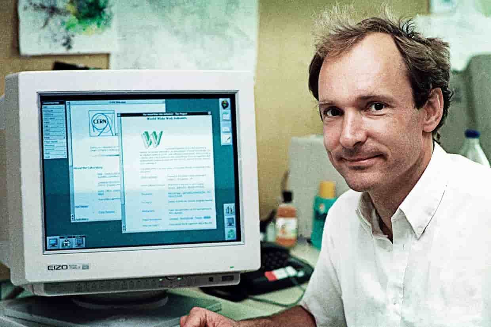

# Breve historia de HTML, CSS y JavaScript

## La historia de HTML

La historia de HTML, el lenguaje de marcado de hipertexto, comienza a **finales de la década de 1980** y **principios de la década de 1990** con el trabajo de **Tim Berners-Lee** en el **CERN (Organización Europea para la Investigación Nuclear)** en Ginebra, Suiza. Berners-Lee, un físico e informático británico, estaba buscando una forma de permitir que los investigadores compartieran fácilmente documentos y datos a través de una red.

En 1989, Berners-Lee propuso un proyecto basado en la unión de la tecnología de hipertexto con la creciente expansión de Internet. Su visión era crear una **"red de información"** donde los documentos pudieran ser interconectados a través de enlaces. Para esto, desarrolló el primer navegador web y el primer servidor web, junto con el **lenguaje de marcado** que permitiría estructurar los documentos: HTML.

_Tim Berners Lee_

HTML fue diseñado para ser un lenguaje sencillo, utilizando **etiquetas de marcado** que los navegadores web podían interpretar para mostrar texto, imágenes, y otros contenidos de manera estructurada. Las primeras versiones de HTML eran bastante básicas, permitiendo la creación de encabezados, párrafos, listas y enlaces.

En **1991**, Tim Berners-Lee publicó la primera versión oficial de HTML, conocida como HTML 1.0. Este lenguaje rápidamente ganó popularidad, y la comunidad técnica comenzó a expandir y mejorar sus capacidades. En **1995**, se introdujo HTML 2.0, que estandarizó muchas características que ya estaban siendo utilizadas.

La evolución continuó con **HTML 3.2 en 1997**, que agregó soporte para tablas, scripts y más estilos de presentación. **HTML 4.0, lanzado en 1997** y **actualizado en 1999**, fue un gran avance al introducir la separación entre el contenido (HTML) y la presentación (CSS), promoviendo el uso de hojas de estilo en cascada.

_Logo de HTML5_

Con el auge de la web móvil y la necesidad de mejorar la interoperabilidad y accesibilidad, se inició el desarrollo de HTML5 en la década de 2000. HTML5, lanzado oficialmente en 2014, es una revisión importante que incluye nuevas etiquetas semánticas, soporte para multimedia (audio y video), gráficos (canvas y SVG), y mejor manejo de aplicaciones web complejas.

Hoy en día, HTML sigue siendo la piedra angular del desarrollo web, facilitando la creación de sitios y aplicaciones accesibles y ricos en contenido. La evolución de HTML refleja la continua innovación en la web, adaptándose a nuevas tecnologías y necesidades de los usuarios en todo el mundo.

## Hitoria de CSS

La historia de **CSS (Cascading Style Sheets, o Hojas de Estilo en Cascada)** está estrechamente ligada a la **evolución de HTML** y la necesidad de separar el contenido de la presentación en la web. La idea detrás de CSS surgió en los primeros años de la web, cuando los desarrolladores web empezaron a reconocer las limitaciones de HTML para manejar el estilo y el diseño de las páginas web.

### Los Primeros Años

En los inicios de la web, la única forma de diseñar una página web era utilizando las capacidades de presentación limitadas de HTML. Los desarrolladores usaban **tablas y etiquetas ``** para controlar el diseño y la apariencia del texto, lo cual resultaba en código complicado y difícil de mantener. Además, estas técnicas mezclaban el contenido y la presentación, lo que iba en contra de las buenas prácticas de diseño y desarrollo.

### La Propuesta de CSS

En **1994**, **Håkon Wium Lie**, entonces trabajando en el **CERN** (la misma institución donde Tim Berners-Lee desarrolló HTML), propuso un nuevo lenguaje que permitiría a los diseñadores web definir la presentación de los documentos HTML de manera más efectiva. Este lenguaje, llamado CSS, **permitiría separar el contenido (HTML) de la presentación (estilos)**.

En **1996**, el **World Wide Web Consortium (W3C)** publicó la primera especificación oficial de CSS, conocida como **CSS1**. Esta especificación proporcionaba una forma simple de aplicar estilos a los documentos HTML, incluyendo fuentes, colores, y espaciamiento.

### Adopción y Evolución

Aunque CSS1 fue un paso importante, la adopción inicial fue lenta debido a la falta de soporte uniforme entre los navegadores web de la época. Sin embargo, con el tiempo, **los navegadores comenzaron a mejorar su compatibilidad con CSS**, lo que llevó a una mayor aceptación entre los desarrolladores web.

En **1998**, se lanzó **CSS2**, que introdujo nuevas capacidades como **posicionamiento absoluto y relativo**, estilos para diferentes tipos de dispositivos (pantallas, impresoras, etc.), y un mayor control sobre el diseño de las páginas. CSS2 también mejoró la accesibilidad y la internacionalización de las páginas web.

### CSS3 y Más Allá

El desarrollo de **CSS3** comenzó en la década de **2000**, con el objetivo de modularizar el lenguaje en diferentes módulos, lo que permitía a los navegadores implementar nuevas características de forma más flexible. **CSS3 introdujo una amplia gama de nuevas capacidades**, incluyendo:

**Selectores avanzados**: Permiten seleccionar y aplicar estilos a elementos de manera más precisa.

**Nuevas propiedades de diseño**: Flexbox y Grid Layout proporcionan potentes herramientas para crear diseños complejos y responsivos.

**Efectos visuales**: Transiciones, transformaciones, y animaciones permiten crear efectos visuales dinámicos sin necesidad de JavaScript.

**Mejores opciones tipográficas**: Web fonts y características tipográficas avanzadas mejoran la apariencia del texto en la web.

### El Estado Actual de CSS

Hoy en día, CSS es una parte fundamental del desarrollo web. Con la creciente importancia del diseño responsivo y la necesidad de crear **experiencias de usuario ricas y accesibles**, CSS sigue evolucionando. Los desarrolladores web pueden aprovechar una amplia gama de **herramientas y frameworks basados en CSS**, como **Bootstrap** y **Tailwind CSS**, para agilizar el desarrollo y asegurar la consistencia del diseño.

El continuo desarrollo y mejora de CSS por parte del **W3C** y la **comunidad de desarrollo web** asegura que CSS siga siendo una herramienta poderosa y flexible para diseñar y presentar contenido en la web, adaptándose a nuevas tecnologías y tendencias en el diseño web.

## Historia de JavaScript

### Creación y Primeros Años

JavaScript fue creado por **Brendan Eich** en **1995** mientras trabajaba en **Netscape Communications Corporation**. Netscape quería un lenguaje de scripting ligero y fácil de usar para el navegador web **Netscape Navigator**. Eich desarrolló el lenguaje **en solo 10 días**, inicialmente bajo el nombre de **Mocha**, luego se cambió a **LiveScript**, y finalmente a **JavaScript** para aprovechar la popularidad de Java en ese momento, aunque los dos lenguajes no están directamente relacionados.

JavaScript fue lanzado con **Netscape Navigator 2.0** en diciembre de **1995**. La simplicidad y la capacidad de JavaScript para interactuar con el HTML de una página permitieron a los desarrolladores añadir interactividad y dinamismo a las páginas web.

_Brendan Eich_

### Estandarización

Con el rápido crecimiento de Internet, la necesidad de un estándar para JavaScript se hizo evidente. En **1997**, la organización de estándares **ECMA (European Computer Manufacturers Association)** publicó la primera versión de ECMAScript (ECMA-262), el estándar oficial que define el núcleo del lenguaje JavaScript.

Microsoft, queriendo competir con Netscape, lanzó **JScript con Internet Explorer 3.0 en 1996**. JScript era esencialmente una implementación de JavaScript. La competencia entre Netscape y Microsoft llevó a una situación en la que los desarrolladores web tenían que lidiar con las diferencias entre los navegadores, un fenómeno conocido como **"guerra de navegadores"**.

### Evolución del Lenguaje

El desarrollo de ECMAScript continuó con varias ediciones importantes:

**ECMAScript 3 (1999)**: Esta versión introdujo muchas características esenciales y se mantuvo como la base del lenguaje durante muchos años.
**ECMAScript 4**: Se propuso como una revisión importante con nuevas características avanzadas, pero fue abandonado debido a diferencias significativas entre laspartes interesadas.
**ECMAScript 5 (2009)**: Esta versión trajo mejoras importantes en el lenguaje, como el modo estricto, mejores métodos de matriz, y más.

### La Era Moderna

La versión ECMAScript 6 (ES6), también conocida como ECMAScript 2015, representó un punto de inflexión significativo. Introdujo muchas características nuevas y potentes, como:

**Sintaxis de clases**: Para definir clases de manera más clara.
**Módulos**: Para una mejor organización del código.
**Arrow functions**: Una sintaxis más concisa para las funciones.
**Promesas**: Para manejar operaciones asincrónicas de manera más sencilla.
**Destructuring**: Para extraer valores de matrices y objetos de manera más clara.

Desde ES6, el estándar ECMAScript ha adoptado un **ciclo de lanzamiento anual**, introduciendo nuevas características y mejoras de manera incremental.

### Node.js y el Ecosistema de JavaScript

En **2009**, **Ryan Dahl** lanzó **Node.js**, una plataforma construida sobre el **motor V8 de JavaScript de Google**. Node.js permitió a los desarrolladores ejecutar JavaScript en el servidor, expandiendo enormemente el uso y las capacidades del lenguaje. Con Node.js, JavaScript se convirtió en un lenguaje de propósito general, permitiendo la construcción de aplicaciones completas usando JavaScript **tanto en el lado del cliente como en el servidor**.

El ecosistema de JavaScript también ha florecido con la creación de numerosos frameworks y bibliotecas como **React**, **Angular**, y **Vue.js** para el desarrollo front-end, y Express.js para el desarrollo back-end con Node.js.

### El Presente y Futuro de JavaScript

Hoy en día, JavaScript **es uno de los lenguajes de programación más utilizados en el mundo**. Su capacidad para adaptarse y evolucionar ha permitido que siga siendo relevante y poderoso en un paisaje tecnológico en constante cambio. Con el continuo desarrollo de nuevas características y mejoras a través del proceso de estandarización de ECMAScript, **JavaScript sigue siendo una herramienta crucial para desarrolladores web y más allá**.

El futuro de JavaScript parece prometedor, con nuevas propuestas y mejoras continuas que buscan hacer el lenguaje más eficiente, seguro y fácil de usar, asegurando que siga siendo una piedra angular del desarrollo web en los años venideros.
