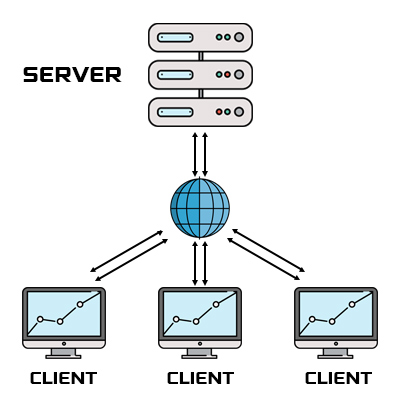
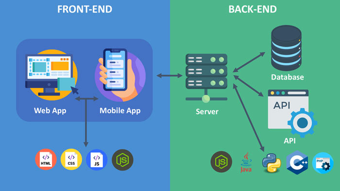
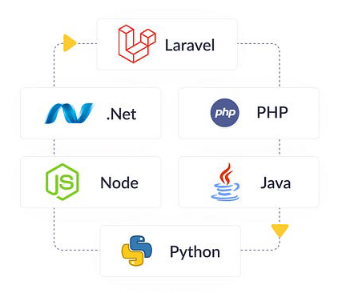

# Introducción al desarrollo web y su importancia

El desarrollo web es una disciplina fascinante y en constante evolución que ha transformado la manera en que interactuamos con el mundo digital. Desde la creación de simples páginas estáticas hasta aplicaciones web complejas, el desarrollo web abarca una amplia gama de técnicas y tecnologías que permiten a los desarrolladores crear experiencias dinámicas e interactivas para los usuarios.

<iframe
  src="https://www.youtube.com/embed/IZMQxhbLjWg?si=mN0OeSC7iuHdzyc8"
  title="YouTube video player"
  frameborder="0"
  allow="accelerometer; autoplay; clipboard-write; encrypted-media; gyroscope; picture-in-picture; web-share"
  referrerpolicy="strict-origin-when-cross-origin"
  allowfullscreen
  style={{ width: "100%", height: "380px" }}
></iframe>

## ¿Qué es el Desarrollo Web?

El desarrollo web se refiere a la creación y mantenimiento de sitios web. Incluye aspectos como el diseño web, la creación de contenido web, la programación del lado del cliente/servidor y la configuración de la seguridad de la red. El desarrollo web se puede dividir en dos categorías principales: **frontend** y **backend**.



- **Frontend**: Se refiere a todo lo que los usuarios ven y con lo que interactúan en un navegador web. Esto incluye HTML, CSS y JavaScript.
- **Backend**: Se refiere a lo que sucede en el servidor, donde se almacenan y gestionan los datos. Esto incluye lenguajes de programación y tecnologías como PHP, Ruby, Python, Java y bases de datos como MySQL y MongoDB.



## Importancia del Desarrollo Web

El desarrollo web es crucial por varias razones:

### 1. **Accesibilidad y Alcance Global**

Los sitios web permiten que las empresas y organizaciones lleguen a una audiencia global. No importa dónde te encuentres, siempre que tengas acceso a Internet, puedes acceder a la información en un sitio web.

### 2. **Interacción y Comunicación**

Los sitios web proporcionan una plataforma para la comunicación y la interacción. Ya sea a través de formularios de contacto, comentarios o chat en vivo, los sitios web permiten a los usuarios interactuar con las empresas de manera efectiva.

### 3. **Crecimiento Profesional**

Aprender desarrollo web abre muchas oportunidades profesionales. Los desarrolladores web son muy demandados en el mercado laboral actual, y las habilidades adquiridas pueden aplicarse a una variedad de roles en tecnología.

### 4. **Innovación y Creatividad**

El desarrollo web fomenta la innovación y la creatividad. Permite a los desarrolladores experimentar con nuevas tecnologías y métodos para crear experiencias de usuario únicas e innovadoras.

### 5. **Adaptabilidad y Flexibilidad**

Los sitios web pueden adaptarse y evolucionar según las necesidades del negocio y las demandas del mercado. Esto incluye la capacidad de actualizar el contenido, implementar nuevas funcionalidades y mejorar la experiencia del usuario.

### 6. **Impacto Económico**

El comercio electrónico es una de las mayores áreas de impacto del desarrollo web. Los sitios web de comercio electrónico permiten a las empresas vender productos y servicios en línea, lo que puede aumentar significativamente los ingresos y expandir el alcance del negocio.

## Primeros Pasos en el Desarrollo Web

Para comenzar con el desarrollo web, es importante familiarizarse con las tecnologías básicas:

- **HTML (HyperText Markup Language)**: El lenguaje estándar para crear páginas web.

```html title="index.html"
<!DOCTYPE html>
<html lang="es">
  <head>
    <meta charset="UTF-8" />
    <meta name="viewport" content="width=device-width, initial-scale=1.0" />
    <title>Ejemplo de Código HTML</title>
  </head>
  <body>
    <!-- Encabezado principal de la página -->
    <h1>Bienvenido a mi página web</h1>

    <script src="script.js"></script>
    <!-- Enlace al archivo JavaScript -->
  </body>
</html>
```

- **CSS (Cascading Style Sheets)**: Utilizado para diseñar y dar formato a la presentación de una página web.

```css title="styles.css"
/* Estilos generales */
body {
  font-family: Arial, sans-serif;
  background-color: #f4f4f4;
  color: #333;
}
```

- **JavaScript**: Un lenguaje de programación que permite crear contenido interactivo en las páginas web.

```javascript title="script.js"
function cambiarTexto() {
  document.getElementById("demo").innerHTML = "¡El texto ha cambiado!";
}
```

En los próximos capítulos, exploraremos estos conceptos en detalle, comenzando con la estructura básica de una página web utilizando HTML. También aprenderás cómo estilizar tus páginas con CSS y cómo añadir interactividad con JavaScript.



Estamos emocionados de acompañarte en este viaje de aprendizaje y esperamos que disfrutes cada paso del proceso. **¡Vamos a empezar!**


---
