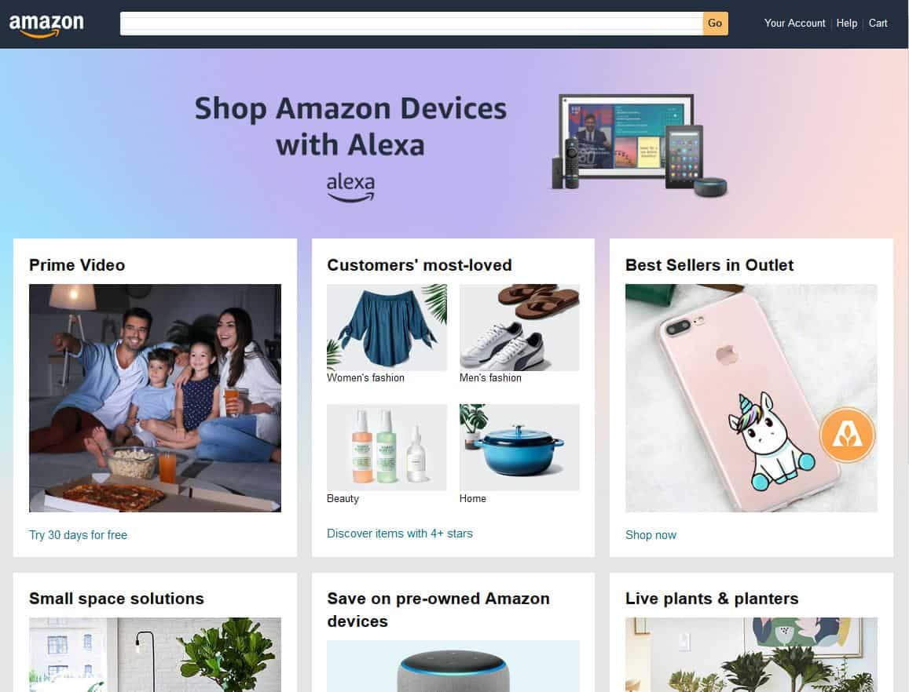
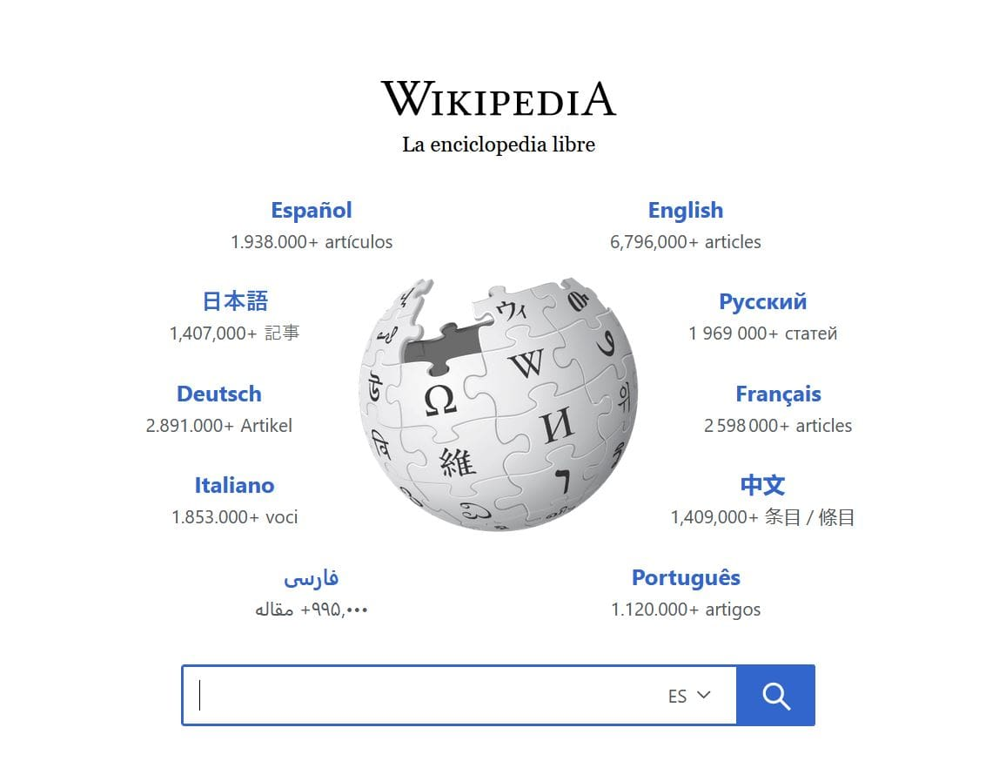
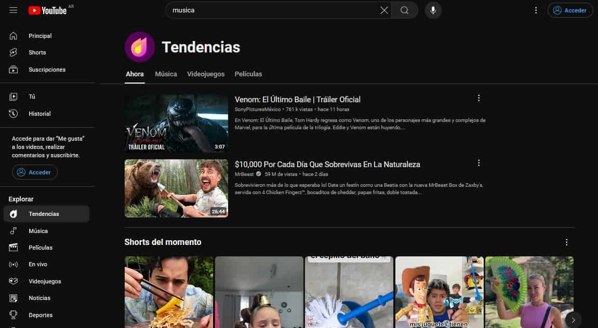

# Caso de Estudio y Ejemplos Prácticos

En el mundo del desarrollo web, estudiar casos reales y ejemplos prácticos nos proporciona una comprensión más profunda de cómo se pueden aplicar los principios y técnicas de desarrollo web en situaciones del mundo real. En este artículo, exploraremos algunos sitios web influyentes que han tenido un gran impacto y analizaremos proyectos reales desde la conceptualización hasta la implementación.

## Sitios Web Influyentes

### Amazon

[Amazon](https://www.amazon.com/) ha transformado el comercio electrónico desde su lanzamiento en 1995. Inicialmente, una librería en línea, Amazon ha crecido hasta convertirse en una de las plataformas de comercio electrónico más grandes del mundo, ofreciendo una amplia gama de productos y servicios.

**Impacto:**

- **Innovación en Comercio Electrónico:** Amazon ha establecido estándares para la experiencia de usuario en comercio electrónico, incluyendo recomendaciones personalizadas y una interfaz fácil de usar.
- **Infraestructura de Cloud Computing:** Amazon Web Services (AWS) ha revolucionado la industria de la tecnología proporcionando servicios de cloud computing accesibles y escalables.

### Wikipedia

[Wikipedia](https://www.wikipedia.org/) es una enciclopedia en línea gratuita y de contenido abierto que se ha convertido en una fuente de información globalmente reconocida desde su creación en 2001.

**Impacto:**

- **Acceso a la Información:** Wikipedia ha democratizado el acceso a la información, permitiendo a millones de personas en todo el mundo acceder a conocimiento gratuito y confiable.
- **Modelo de Colaboración Abierta:** El modelo de edición abierta de Wikipedia permite que cualquier persona con acceso a Internet contribuya al contenido, fomentando una comunidad global de colaboradores.

### YouTube

[YouTube](https://www.youtube.com/) ha cambiado la forma en que consumimos y compartimos contenido multimedia desde su lanzamiento en 2005.

**Impacto:**

- **Plataforma de Contenido:** YouTube ha permitido a creadores de contenido de todo el mundo compartir sus videos con una audiencia global.
- **Innovación en Publicidad:** YouTube ha introducido nuevas formas de publicidad digital, incluyendo anuncios preroll y contenido patrocinado.

## Proyectos Reales

### Proyecto 1: Plataforma de Educación en Línea

#### Conceptualización

La idea surgió de la necesidad de proporcionar educación accesible y de alta calidad a personas en áreas remotas. El objetivo era crear una plataforma que ofreciera cursos en línea, materiales de estudio y foros de discusión.

#### Implementación

- **Tecnologías Utilizadas:** React para el frontend, Node.js para el backend, y MongoDB como base de datos.
- **Características Clave:**
  - **Registro de Usuarios:** Permitir a los usuarios crear cuentas y acceder a cursos.
  - **Biblioteca de Cursos:** Una amplia gama de cursos en diversos campos.
  - **Foros de Discusión:** Espacios para que los estudiantes discutan temas relacionados con los cursos.

#### Resultados

La plataforma ha sido un éxito, con miles de usuarios registrados y una creciente biblioteca de cursos. La retroalimentación de los usuarios ha sido positiva, destacando la facilidad de uso y la calidad del contenido.

### Proyecto 2: Aplicación de Entrega de Alimentos

#### Conceptualización

El objetivo era desarrollar una aplicación móvil que conectara a los usuarios con restaurantes locales, permitiéndoles ordenar comida y recibirla en sus hogares.

#### Implementación

- **Tecnologías Utilizadas:** Flutter para el desarrollo móvil, Firebase para la autenticación y la base de datos en tiempo real.
- **Características Clave:**
  - **Exploración de Restaurantes:** Los usuarios pueden explorar restaurantes cercanos y ver menús.
  - **Seguimiento de Pedidos:** Seguimiento en tiempo real del estado del pedido desde la preparación hasta la entrega.
  - **Sistema de Calificación:** Los usuarios pueden calificar y dejar reseñas sobre los restaurantes y los pedidos.

#### Resultados

La aplicación ha sido bien recibida en la comunidad local, con una base de usuarios en constante crecimiento. Los restaurantes han reportado un aumento en los pedidos y los usuarios aprecian la conveniencia y el tiempo de entrega rápido.

## Conclusiones

Estudiar sitios web influyentes y analizar proyectos reales nos brinda valiosas lecciones sobre cómo aplicar principios de desarrollo web de manera efectiva. Desde la conceptualización hasta la implementación, estos ejemplos demuestran la importancia de la planificación cuidadosa, la elección de tecnologías adecuadas y la atención a las necesidades del usuario. Al aprender de estos casos, los desarrolladores pueden inspirarse y aplicar estas lecciones en sus propios proyectos, contribuyendo al crecimiento y la innovación en el campo del desarrollo web.
