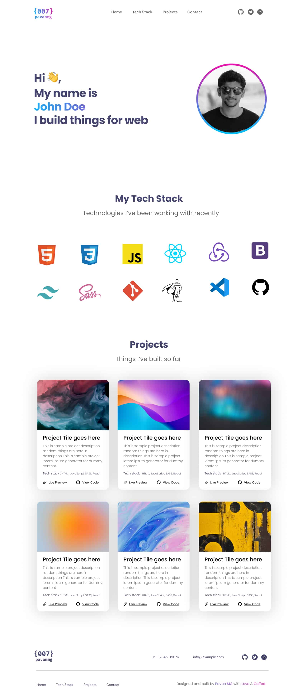
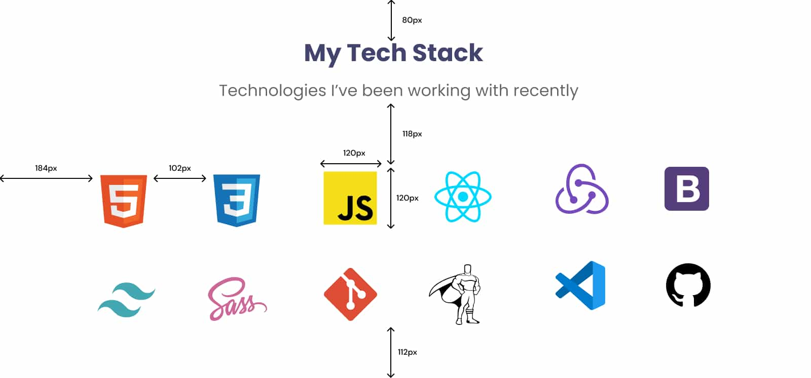

# Ejercicio 9

## Creación de un Portafolio Completo con HTML y CSS

En este ejercicio, vamos a desarrollar un portafolio web completo utilizando HTML y CSS. Para el diseño, seguiremos el proyecto de **Pavan MG** en **Figma**.

Este proyecto incluye cuatro secciones distintas en una única página, con enlaces de anclaje en un menú principal para facilitar la navegación.

## Estructura del Proyecto

El portafolio constará de las siguientes secciones:

1. **Main:** La sección principal, que incluirá un header, una breve introducción y una imagen destacada.
2. **Stack:** Aquí se detallará la tecnología y las herramientas que utilizas, con iconos y descripciones breves.
3. **Projects:** Una galería de tus proyectos más importantes, cada uno con una imagen, un título y una breve descripción.
4. **Footer:** El pie de página, que incluirá enlaces a tus redes sociales y tu información de contacto.

## Imagen principal del porfolio

## Detalles del Diseño

Las imágenes de cada sección, cuentan con las medidas más importantes. Además en las diferentes secciones, se indican colores, estilos y tamaños de fuentes.

## Porfolio - Sección Main

### Detalles de diseño de la sección Main:

- **Logo:** Puede ser una imagen svg o png de no más de 60px de alto, con tu nombre. También puedes usar un texto "span".
- **Links:** Fuente "DM Sans", Medium, de 20px y color `#666666`.
- **Iconos:** De tamaño 30px x 30px, y `fill` de `#666666`.
- **Texto principal:** Fuente "Poppins", Bold, de 58px, color `#42446E` y espacio entre líneas de -1px. Además, un fragmento del texto tiene un color degradado que va de 0% - `#13B0F5` a 100% - `#E70FAA`
- **Imagen principal:** Circular de 350px con borde de color degradado que va de 0% - `#E70FAA` a 100% - `#00C0FD`.

## Porfolio - Sección Stack

### Detalles de diseño de la sección Stack:

- **Título:** Fuente "Poppins", Bold, de 48px y color `#42446E`.
- **Subtítulo:** Fuente "Poppins", Regular, de 32px y color `#666666`.
- **Iconos:** Contenedor `div` de 120px x 120px con un padding de 8px.

## Porfolio - Sección Projects

## Porfolio - Sección Footer

### Recursos

[**Iconos de React Icons**](https://react-icons.github.io/react-icons/)
