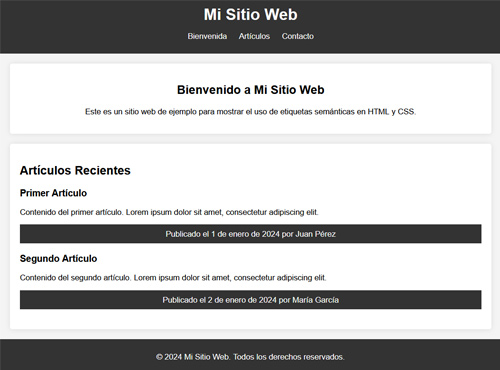

# Ejercicio práctico HTML 1

## Objetivo

Crear un Documento HTML Básico

### Actividad

Crea un archivo HTML básico con la estructura mínima `<!DOCTYPE html>`, `<html>`, `<head>`, `<body>`.

### Solución

```html title="html"
<!DOCTYPE html>
<html>
  <head>
    <title>Documento HTML Básico</title>
  </head>
  <!-- Este es un comentario HTML  -->
  <body>
    <h1>Hola, Mundo!</h1>
  </body>
</html>
```

<!--
## Objetivo

Crear una página web simple con HTML y CSS que incluya las siguientes secciones:

1. Encabezado (`<header>`) con un título y un menú de navegación.
2. Una sección de bienvenida (`<section>`) con un mensaje de bienvenida.
3. Una sección de artículos (`<section>`) con dos artículos (`<article>`).
4. Un pie de página (`<footer>`).

## Paso 1: Estructura HTML

Crea un archivo llamado index.html y escribe la estructura básica del HTML con las etiquetas semánticas.

### Solución

```html title="index.html"
<!DOCTYPE html>
<html lang="es">
  <head>
    <meta charset="UTF-8" />
    <meta name="viewport" content="width=device-width, initial-scale=1.0" />
    <title>Maqueta de Página Web</title>
    <link rel="stylesheet" href="styles.css" />
  </head>
  <body>
    <header>
      <h1>Mi Sitio Web</h1>
      <nav>
        <ul>
          <li><a href="#bienvenida">Bienvenida</a></li>
          <li><a href="#articulos">Artículos</a></li>
          <li><a href="#contacto">Contacto</a></li>
        </ul>
      </nav>
    </header>

    <section class="bienvenida">
      <h2>Bienvenido a Mi Sitio Web</h2>
      <p>
        Este es un sitio web de ejemplo para mostrar el uso de etiquetas
        semánticas en HTML y CSS.
      </p>
    </section>

    <section class="articulos">
      <h2>Artículos Recientes</h2>
      <article>
        <h3>Primer Artículo</h3>
        <p>
          Contenido del primer artículo. Lorem ipsum dolor sit amet, consectetur
          adipiscing elit.
        </p>
        <footer>Publicado el 1 de enero de 2024 por Juan Pérez</footer>
      </article>
      <article>
        <h3>Segundo Artículo</h3>
        <p>
          Contenido del segundo artículo. Lorem ipsum dolor sit amet,
          consectetur adipiscing elit.
        </p>
        <footer>Publicado el 2 de enero de 2024 por María García</footer>
      </article>
    </section>

    <footer>
      <p>&copy; 2024 Mi Sitio Web. Todos los derechos reservados.</p>
    </footer>
  </body>
</html>
```

## Paso 2: Estilos CSS

Crea un archivo llamado styles.css y añade los siguientes estilos para darle un diseño básico a tu página.

```css title="styles.css"
/* styles.css */
/* body {
  font-family: Arial, sans-serif;
  margin: 0;
  padding: 0;
  background-color: #f4f4f4;
}

header {
  background-color: #333;
  color: white;
  padding: 10px 0;
  text-align: center;
}

header h1 {
  margin: 0;
}

nav ul {
  list-style: none;
  padding: 0;
}

nav ul li {
  display: inline;
  margin: 0 10px;
}

nav ul li a {
  color: white;
  text-decoration: none;
}

nav ul li a:hover {
  text-decoration: underline;
}

section {
  padding: 20px;
  margin: 20px;
  background-color: white;
  border-radius: 5px;
  box-shadow: 0 0 10px rgba(0, 0, 0, 0.1);
}

.bienvenida {
  text-align: center;
}

article {
  margin-bottom: 20px;
}

article h3 {
  margin-top: 0;
}

footer {
  background-color: #333;
  color: white;
  text-align: center;
  padding: 10px 0;
  position: absolute;
  width: 100%;
  bottom: 0;
} */
```

## Resultado Final

Al abrir index.html en tu navegador, deberías ver una página web estructurada y estilizada con un encabezado, una sección de bienvenida, una sección de artículos, y un pie de página. Puedes modificar y expandir esta maqueta según tus necesidades y practicar añadiendo más contenido y estilos.

 -->
